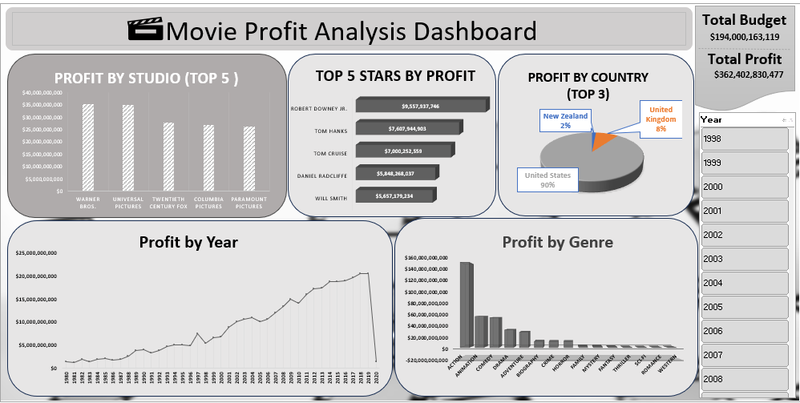

#  Movie Profit Analysis Dashboard

##  Project Overview
This project analyzes movie profitability using Excel by comparing budget and gross revenue.  
A profit column was created (Profit = Gross - Budget) to enable deeper analysis and better insights.

---

##  Key Insights
- Top 5 studios by profit  
- Top 5 stars contributing to profit  
- Top 3 countries by profit  
- Profit distribution by genre  

---

##  KPIs
- Total Budget  
- Total Profit  

---

##  Tools Used
- Microsoft Excel  
- Pivot Tables  
- Charts  
- Slicers  

---

## Interactivity
- Year slicer for dynamic filtering and time-based analysis  

---

## 📷 Dashboard Preview

